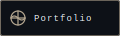
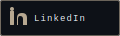
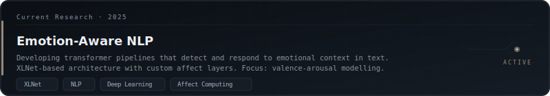
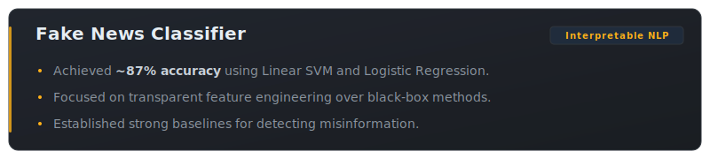
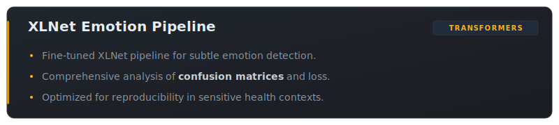
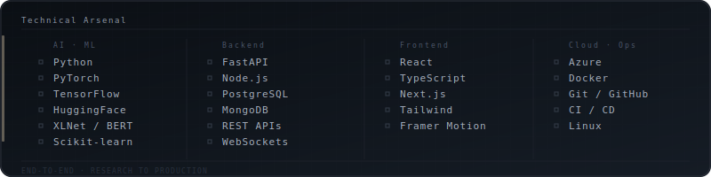

[.gif)](https://github.com/Luc0-0/animated_banner)

<div align="center">
    <a href="https://git.io/typing-svg">
        
    </a>
</div>

<br/>

<div align="center">
    
</div>

<br/>

<div align="left">

```
  Nipun Sujesh  ·  AI/ML + Full-Stack  ·  Research-Driven Builder
  ─────────────────────────────────────────────────────────────────
  I don't just write code.
  I build systems that learn, adapt, and understand.

  From raw data to deployed models —
  From research papers to production APIs —
  That's the space I work in.
```

</div>

<br/>

<div align="left">
    <a href="https://nipun.space" target="_blank" style="margin-right: 12px;">
       
    </a>
    <a href="https://linkedin.com/in/nipun-sujesh" target="_blank" style="margin-right: 12px;">
       
    </a>
    <a href="mailto:nipunsujesh28@gmail.com">
       
    </a>
</div>

<br/>

<div align="center">
    
</div>

<br/>

## ◈ &nbsp; Current Research

> *The machine doesn't feel. Yet. — That's the problem I'm working on.*

<div align="center">
    
</div>

<br/>

<div align="center">
    
</div>

<br/>

## ◈ &nbsp; Selected Works

> *Not projects. Proofs of concept that became production.*

<div align="center">
    
    <br/><br/>
    
    <br/><br/>
    
</div>

<br/>

<div align="center">
    
</div>

<br/>

## ◈ &nbsp; Technical Arsenal

> *Tools are just vocabulary. Mastery is knowing what to say.*

<div align="center">
    
</div>

<br/>

<!-- Compact badge row -->
<div align="center">


</div>

<br/>

<div align="center">
    
</div>

<br/>

## ◈ &nbsp; Impact

<br/>

<div align="center">

<table style="border: none; border-collapse: collapse; width: 100%;">
    <tr>
        <td align="center" style="border: none; padding: 8px;">
            
        </td>
        <td align="center" style="border: none; padding: 8px;">
            
        </td>
        <td align="center" style="border: none; padding: 8px;">
            
        </td>
    </tr>
</table>

</div>

<br/>

<div align="center">
    
    &nbsp;&nbsp;
    
</div>

<br/>

<div align="center">
  <picture>
    <source media="(prefers-color-scheme: dark)" srcset="https://raw.githubusercontent.com/Luc0-0/Luc0-0/output/github-contribution-grid-snake-dark.svg">
    <source media="(prefers-color-scheme: light)" srcset="https://raw.githubusercontent.com/Luc0-0/Luc0-0/output/github-contribution-grid-snake.svg">
    
  </picture>
</div>

<br/>
<br/>

<div align="center">

```
  "The goal is not to be seen.
   The goal is to be understood."
                    — N.S.
```

</div>

<br/>

<div align="center">
    
</div>

<br/>

<div align="center">
    
</div>

<p align="center">
    
</p>
