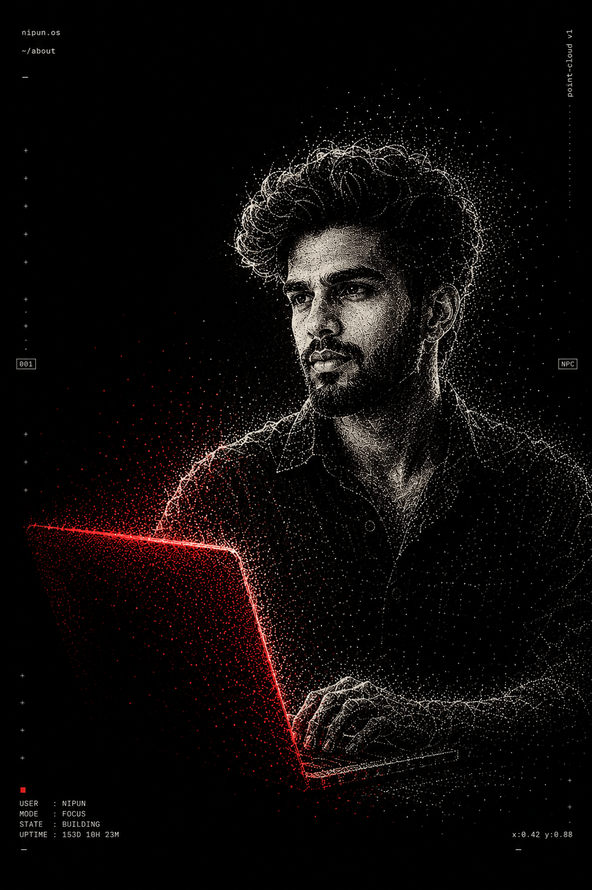
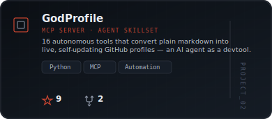
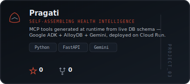
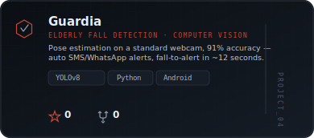
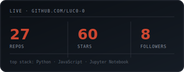
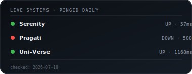

<table>
<tr>
<td width="52%" valign="top">

```
 user   : nipun sujesh
 role   : ai/ml engineer · full-stack developer
 stack  : python · pytorch · react · typescript
 status : building in public
```

 <sub>still typing…</sub>

AI/ML engineer and full-stack developer building research-driven, end-to-end
systems — from fine-tuned transformer classifiers to production web apps on
FastAPI, React, and Python. I ship working code over slide decks.

<a href="https://nipun.space"></a>&nbsp;&nbsp;<a href="https://linkedin.com/in/nipun-sujesh"></a>&nbsp;&nbsp;<a href="mailto:nipunsujesh28@gmail.com"></a>

<br/><br/>

       <br/>      

<br/><br/>

<a href="https://uni-verse.co.in"></a>

</td>
<td width="48%" align="right" valign="top">

</td>
</tr>
</table>

---

<div align="center">

### Signature Projects

<table>
  <tr>
    <td width="50%"><a href="https://github.com/Luc0-0/Serenity-Multi-Modal-Mental-Assistant-System"></a></td>
    <td width="50%"><a href="https://github.com/Luc0-0/GodProfile"></a></td>
  </tr>
  <tr>
    <td width="50%"><a href="https://github.com/Luc0-0/pragati"></a></td>
    <td width="50%"><a href="https://github.com/kripasekar187-bit/Guardia-elderly-fall-detection"></a></td>
  </tr>
  <tr>
    <td colspan="2" width="100%"><a href="https://github.com/Luc0-0/StudyPath"></a></td>
  </tr>
</table>

</div>

---

<div align="center">

### Open Source Contribution

<!-- OSS_ORGS -->
<a href="https://github.com/lingdojo" title="lingdojo — 6 PRs"></a> <a href="https://github.com/VoltAgent" title="VoltAgent — 4 PRs"></a> <a href="https://github.com/webpod" title="webpod — 2 PRs"></a> <a href="https://github.com/GoogleCloudPlatform" title="GoogleCloudPlatform — 1 PR"></a> <a href="https://github.com/antfu-collective" title="antfu-collective — 1 PR"></a> <a href="https://github.com/google" title="google — 1 PR"></a> <a href="https://github.com/yargs" title="yargs — 1 PR"></a> <a href="https://github.com/firecrawl" title="firecrawl — 1 PR"></a> <a href="https://github.com/vercel-labs" title="vercel-labs — 1 PR"></a> <a href="https://github.com/apify" title="apify — 1 PR"></a>
<!-- /OSS_ORGS -->

</div>

---

<div align="center">




<br/><br/>



</div>

<div align="center">

<picture>
  <source media="(prefers-color-scheme: dark)" srcset="https://raw.githubusercontent.com/Luc0-0/Luc0-0/output/github-contribution-grid-snake-dark.svg">
  <source media="(prefers-color-scheme: light)" srcset="https://raw.githubusercontent.com/Luc0-0/Luc0-0/output/github-contribution-grid-snake.svg">
  
</picture>

</div>

---

<div align="center">
<p><i>"The best way to predict the future is to invent it."</i></p>
<p><span style="color:#8f98a8; font-size:11.5px; letter-spacing:2px;">— ALAN KAY</span></p>
<br/>

<br/><br/>

<br/><br/>
<sub>last updated: <!-- LAST_UPDATED -->2026-07-20<!-- /LAST_UPDATED --></sub>
</div>
