[.gif)](https://github.com/Luc0-0/animated_banner)

### Nipun Sujesh

**AI/ML + Full-Stack Developer · Research-Driven · End-to-End Solutions**

I build production systems at the intersection of research and delivery.

 

<a href="https://nipun.space" target="_blank">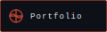</a>&nbsp;&nbsp;&nbsp;&nbsp;&nbsp;&nbsp;



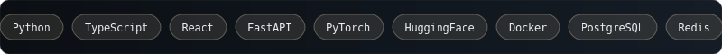

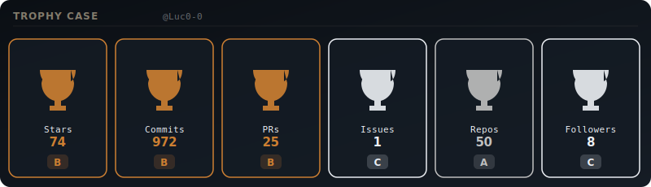

### ✦ &nbsp;Signature Projects

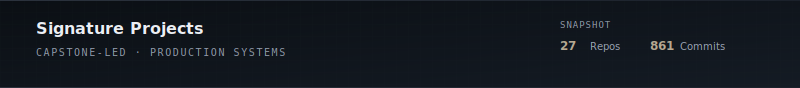

<a href="https://github.com/Luc0-0/Serenity-Multi-Modal-Mental-Assistant-System">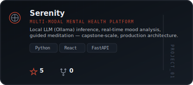</a>

<table>
  <tr>
    <td width="50%" align="center">
      <a href="https://github.com/Luc0-0/Smart-notes-by-Nipun">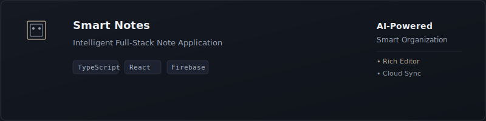</a>
    </td>
    <td width="50%" align="center">
      
    </td>
  </tr>
  <tr>
    <td width="50%" align="center">
      <a href="https://github.com/Luc0-0/xlnet-emotion-classifier">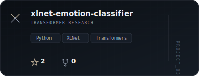</a>
    </td>
    <td width="50%" align="center">
      <a href="https://github.com/Luc0-0/StudyPath">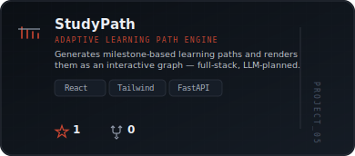</a>
    </td>
  </tr>
</table>

### ✦ &nbsp;Current Research

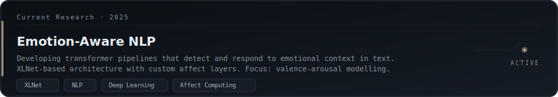

### ✦ &nbsp;Technical Foundation

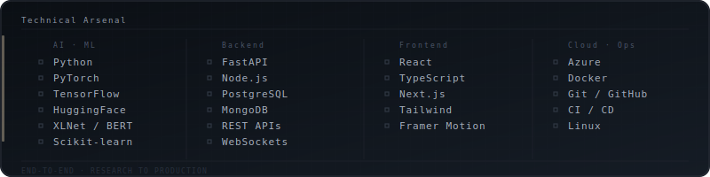

### ✦ &nbsp;Coding Activity

&nbsp;

### ✦ &nbsp;Impact & Contributions

  <picture>
    <source media="(prefers-color-scheme: dark)" srcset="https://raw.githubusercontent.com/Luc0-0/Luc0-0/output/github-contribution-grid-snake-dark.svg">
    <source media="(prefers-color-scheme: light)" srcset="https://raw.githubusercontent.com/Luc0-0/Luc0-0/output/github-contribution-grid-snake.svg">
    
  </picture>

   
  
<i>"The best way to predict the future is to invent it."</i>

  
— ALAN KAY

   
  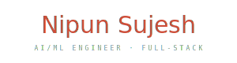
    
  

